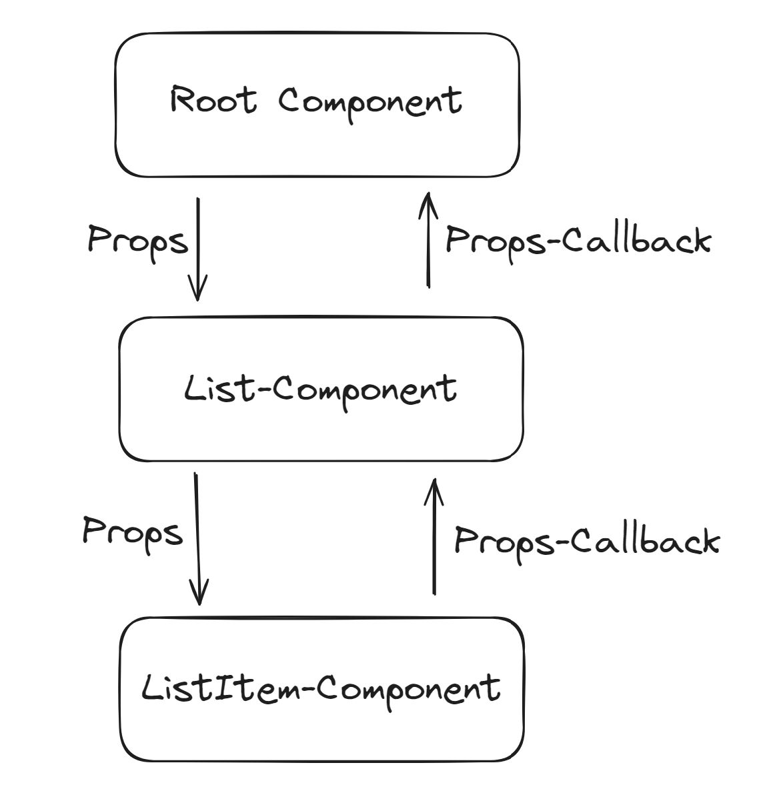
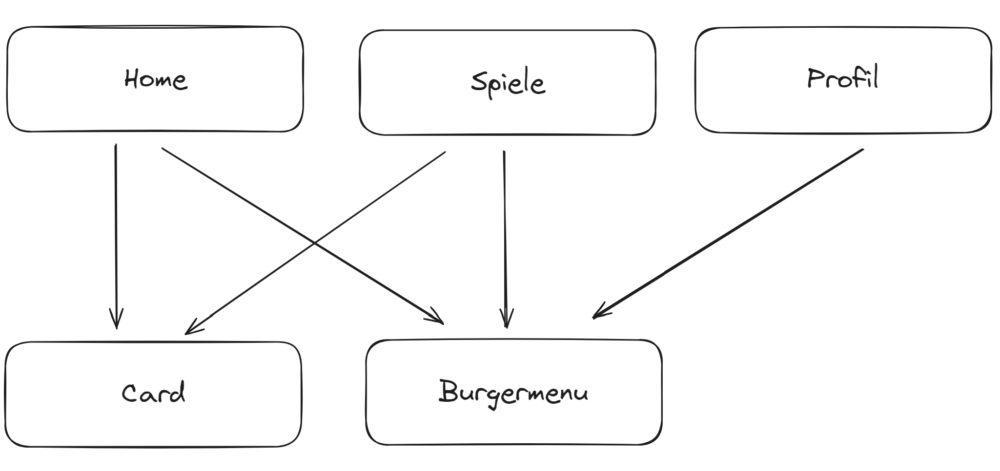

 
Severin Püntener, Remo Scherrer & Livio Moreno Thommen
 
# Einleitung
In diesem Projekt geht es um die Umsetzung von einer Webseite, welche den Kinobesuch für immer verändern wird. Beim Produkt handelt es sich um CINET. Eine Idee von einer Gruppe von genialen Köpfen aus der Schweiz, welche es sich zur Aufgabe gemacht haben den Abend in einem Kino neu zu gestalten.
 
 
 
# Informationen beschaffen
Als erstes haben wir den Auftrag auf Teams durchgelesen und Fragen geklärt. Anschliessend haben wir die uns zur Verfügung gestellten Unterlagen von der Cinet Gruppe angeschaut. Sprich den Styleguide und Sample Screens. Um mögliche Missverständnisse zu vermeiden, haben wir uns danach in der Gruppe über Gelesenes ausgetauscht.
 
# Planen
 
### Aufteilung
 
| Name | zuständig für |
| ---- | ------------- |
| Livio| Dokumentation, Profilseite|
| Severin| Dokumentation, Logik (Punkte), Spieleseite, Registrieren, GitHub-Manager|
| Remo| Dokumentation, Bootstrap, Logik (Punkte), Login|
 
 
### Zeitplan
 
 
| Datum (bis) | Beschreibung |
| ----------- | ----------- |
| 06.05.2024  | Schritte I, P und E dokumentieren       |
| 13.05.2024  | Login, Account erstellen        |
| 27.05.2024  | Home, Burgermenu, Punkte einlösen, Profil, Bootstrap        |
| 03.06.2024  | Spiele, Dokumentation        |
| 10.06.2024  | Dokumentation, Punkte erhöhen, kleine styling Anpassungen        |
 
# Entscheiden
 
## Framework/Programmiersprache
 
Für das Framework haben wir uns aus verschiedenen Gründen für Next entschieden. Einerseits haben wir bereits einiges an Erfahrung mit Next, da wir im Betrieb viel damit arbeitebn. Dazu kommt, dass das Routing bei Next ist sehr einfach ist. Bei der Programmiersprache haben wir uns für Typescript entschieden, da es eine Typisierung erlaubt. Dies hilft Fehler zu vermeiden und unserer Meinung nach, macht es das Übergeben von Properties an Komponenten viel einfacher. Zudem haben wir wie bei Next bereits einiges an Erfahrung damit.
 
## Zusammenarbeit
 
Für die Zusammenarbeit war für uns von Anfang an klar, dass wir GitHub verwenden. Deshalb hatte die Änderung der Rahmenbedingungen des Projekts bezüglich GitHub keinen Einfluss auf uns. Severin hat über seinen GitHub Account ein Repository erstellt. Er Remo und mich (Livio Moreno Thommen) in das Repository eingeladen, damit wir ebenfalls pushen und pullen können. Jeder von uns hat ein lokales Repository auf seiner Festplatte. Dann macht jeder lokale Commits und pusht diese dann ins remote Repository.
 
**GitHub Repo:** https://github.com/SeverinPue/cinet-projekt
 
## Entwicklungsumgebung
 
Die Wahl der Entwicklungsumgebung ist eine sehr persönliche entscheidung. Gewisse Mitglieder der Gruppe haben überlegt IntelliJ zu nutzen, für andere war klar, dass sie Visual Studio Code verwenden werden. Schlussendlich haben wir uns aber alle für Visual Studio Code verwendet, weil wir uns einig waren, dass es besser für Java-/Typescript ist. Natürlich gibt es von Jet Brains auch noch einen eine Javascript Entwicklungsumgebung, mehr für Web. Jedoch hat von uns noch niemand damit gearbeitet und deshalb kam es für uns nicht in Frage.
 
## Dokumentation
 
Für die Dokumentation wollten wir zuerst Word verwenden, jedoch haben wir uns relativ schnell umentschieden, weil wir mehr Zeit mit Grafischen Anpassungen als mit Schreiben verbracht haben. Markdown war für uns die beste Option. Es ist sehr einfach Titel und Listen zu machen sowie kleine Anpassungen an der Schrift vorzunehmen. Dadurch können wir beim Design der Dokumentation viel Zeit sparen und uns mehr auf den Inhalt konzentrieren. Dazu kommt, dass es sich bei Markdown um ein Text Format handelt und es somit von Git gehandelt werden kann. Da ich (Livio Moreno Thommen) bereits ein bisschen Erfahrung mit Markdown habe, haben wir entschieden, dass ich das Dokumentieren übernehme.
 
# Realisieren
 
## Dokumentation
 
Wie dem Zeitplan zu entnehmen ist, haben wir am Anfang einiges an Zeit verbracht die ersten drei Schritte (I, P und E) umzusetzten sowie zu dokumentieren. Den Rest der Dokumentation haben wir am Ende geschrieben.
 
## Login
 
Remo  hat sich um das Login gekümmert. Er hat React-Bootstrap verwendet für die Inputfelder, so konnte er einiges an Zeit sparen. Für das Design hat er sich ziemlich genau an die Sample Screens gehalten. Da es sich nicht um ein echtes Login handelt ist auch kaum Logik vorhanden, somit gab es diesbezüglich keine Probleme.
 
## Account erstellen
Die Seite Account erstellen hat Severin gemacht. Wie bei Remo hatte auch Severin keine grossen Probleme. Teile des Codes von der Login Seite konnte Severin in dieser Seite übernehmen, da die Grundstruktur die selbe ist. Es lohnte sich jedoch nicht einzelne Komponenten dafür zu erstellen, da sie dann doch zu verschieden sind.
 
## Home
 
Diese Seite hat ebenfalls Remo gemacht. Es war etwas schwieriger zu stylen, da der Aufbau etwas komplexer ist. Für das Einlösen der Punkte musste er eine neue Komponente machen, wo er über die Properties eine Bild-Url und Text mitgeben kann. Da Remos Typescript Künste etwas eingerostet waren, brauchte er zuerst etwas Zeit alles wieder aufzufrischen. Unten ist die Definition des Types der Card Properties zu sehen.
 
```typescript
type CardType = {
  title: string;
  imagePath: string;
  points?: string;
  footer?: string;
};
```
 
## Burgermenu
 
Über das Burgermenu kann der Benutzer einfach zwischen den Seiten navigieren. Da es auf fast allen Seiten vorhanden ist, macht es Sinn dieses in eine eigene Komponente auszulagern. Das haben wir natürlich auch gemacht. Da das Burgermenu auf allen Seiten gleich ist, mussten wir nichts via Props mitgeben. Dafür hat es ein klein wenig an Logik darin mit einem useState. Beim useState handelt es sich um einen Boolean, welcher bestimmt ob das Menu angezeigt wird oder nicht. Das Anzeigen haben wir mit Conditional Rendering umgesetzt, womit es ziemlich einfach war. Der Code zum Conditional Rendering ist unten zu sehen. Das doppelte & fungiert als ein if-statement, sprich wenn der Boolean auf true ist wird der Code darunter angezeigt und sonst nicht.
 
```typescript
{open &&
    <Container>
        <Row>
            <Link href={"/"} className='text-decoration-none'>Home</Link>
        </Row>
        <Row>
            <Link href={"/login"} className='text-decoration-none'>Anmelden</Link>
        </Row>
        <Row>
            <Link href={"/addAccount"} className='text-decoration-none'>Registrieren</Link>
        </Row>
        <Row>
            <Link href={"/games"} className='text-decoration-none'>Spiele</Link>
        </Row>
        <Row>
            <Link href={"/profile"} className='text-decoration-none'>Profil</Link>
        </Row>
    </Container>
}
 
```
 
## Profil
 
Die Profil Seite habe ich (Livio Moreno Thommen) gestaltet. Da die Seite ziemlich simpel aufgebaut ist gab es auf der gestalterischen Ebene keine Probleme. Bei den Profilinformationen handelt es sich um default Werte, da es ja kein echtes Login gibt.
 
## Spiele
 
Diese Spiele Seite wurde von Severin gemacht. Bei den Spiele hat er sich für Verlinkungen zu echten Spielen entschieden. Wenn man den Link verwendet werden die Punkte entsprechend erhöht. Severin hat die Card Komponente von Remo verwendet um die Spiele schön darzustellen.
 
## Punkte
 
Die Punkte können über die Spiele Seite gewonnen werden und auf er Home Seite wieder eingelöst werden. Dies war die Vorgabe des Auftrags. Wie das Gewinnen der Punkte funktioniert ist im oberen Abschnitt (Spiele) bereits beschrieben. In diesem Abschnitt geht es viel mehr um die Speicherung der Punkte. Zuerst wollten wir das ganze mit useStates und Variabeln lösen welche via Properties umher geschickt werden. Da wir aber nicht wirklich eine hierarchische Architektur im Programm haben. Praktisch alle Seiten sind auf der selben "Ebene". Deshalb haben wir uns schlussendlich für den Local Storage entschieden, da dieser sehr einfach zu handeln ist.
 
| Hierarchische Architektur | Unsere Architektur |
| ------------------------- | ------------------ |
|  | |
 
# Kontrollieren
 
Fast an der Ziellinie war nun noch mal vollste Konzentration gefragt. Wir haben alle drei die Aufgabenstellung erneut genaustens durchgelesen. Anschliessend haben wir es mit unserer Webseite verglichen und sind sehr zufrieden. Uns sind noch kleine funktionale Dinge aufgefallen, bezüglich der Punkte, jedoch haben wir diese schnell bereinigt. Um die Dokumentation zu kontrollieren ist der Text natürlich online korrigiert und von allen Gruppenmitgliedern überprft worden.
 
 
# Auswerten
 
Da wir nun fertig mit unserem Projekt sind, können wir stolz auf einen ganzen Monat gute Zusammenarbeit zurück blicken. Es gab zwischen durch kleine Komplikationen im Team jedoch haben wir schlussendlich alle am gleichen Strang gezogen und stets professionell geblieben. Mit unserem finalen Produkt sind wir sehr zufrieden und wir konnten in dieser Zeit viel lernen. Nicht nur bezüglich Programmieren sondern auch organisatorische Dinge welche in einer Gruppenarbeit essenziell sind. Wir sind alle der Meinung, dass wir ein gutes Team sind und die Arbeit Niveau sowie Interessen gerecht aufgeteilt wurde. Bei zukünftigen Gruppenarbeiten freuen wir uns bereits auf erneutes gemeinsames Lernen.